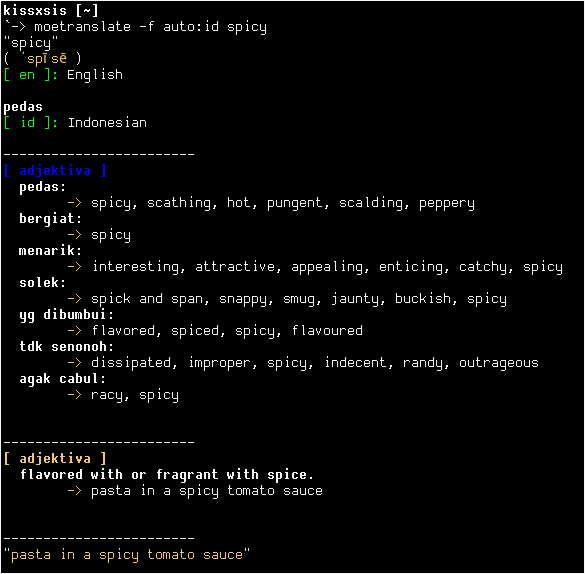

# moetranslate
A simple language translator written in C




## Currently Supported:
1. Google Translate API

## How to Install:

### Debian-based:

```
sudo apt install libcurl4-openssl-dev
make && sudo make install
```

### Arch-based:

```
sudo pacman -S libcurl-gnutls
make && sudo make install
```

## How to Uninstall:

```
sudo make uninstall
```

## How to Use:

```
moetranslate [-b/-f/-r/-d/-h] [SOURCE] [TARGET] [TEXT]

-b = Brief output (only show simple output).
-f = Full/detail output.
-r = Raw output (json).
-i = Interactive input mode.
-d = Detect language.
-h = Show help message.
```


1. Brief output:
	`moetranslate -b auto:id "Hello world\!"`

	`auto` -> automatic detection

	`id`   -> Indonsian language code
2. Full/detail output:
	`moetranslate -f en:id "Hello wrld\!"`

	`en`   -> English language code

	Will show translated WORD/SENTENCE with more information.
3. Interactive input mode:
	```
	moetranslate -i -f en:ja
	moetranslate -i -b auto:en
	```
4. Show help:
	`moetranslate -h`

## Language Code:
https://cloud.google.com/translate/docs/languages
