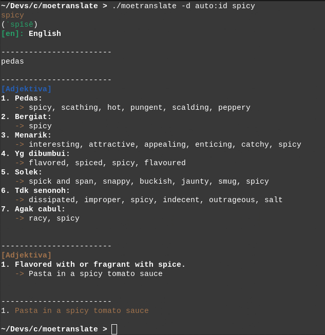

# moetranslate
A simple language translator written in C




## Currently Supported:
1. Google Translate API

## Required Package(s):

```
readline (for interactive input mode)
```

## How to Install:

```
make install
```

or without interactive input mode


```
make install -DWNO_INTERACTIVE_MODE=1
```

## How to Uninstall:

```
make uninstall
```

## How to Use:

```
moetranslate -[s/d/l/i/L/h] [[SOURCE]:[TARGET]] [TEXT]

-s = Simple output
-d = Detail output
-l = Detect language
-L = Language list
-i = Interactive input mode
-h = Show help message
```


1. Simple output:
	`moetranslate -s auto:id "Hello world\!"`

	`auto` -> automatic language

	`id`   -> Indonesian language code
2. Detail output:
	`moetranslate -d en:id "Hello wrld\!"`

	`en`   -> English language code

	Will show translated WORD/SENTENCE with more information.
3. Interactive input mode:
	```
	moetranslate -i
	moetranslate -i -s auto:en
	moetranslate -id auto:en
	```
4. Show help:
	`moetranslate -h`

## Language Code:
https://cloud.google.com/translate/docs/languages
